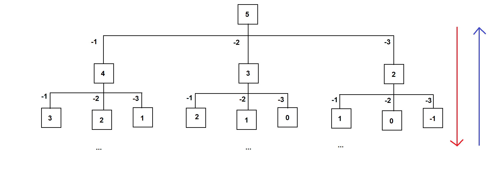
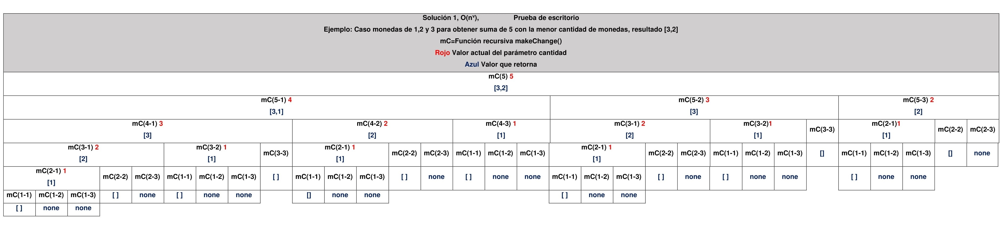
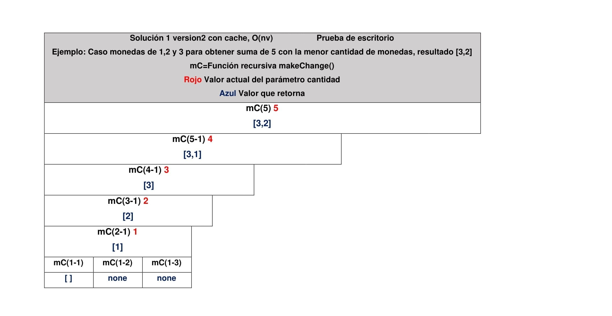
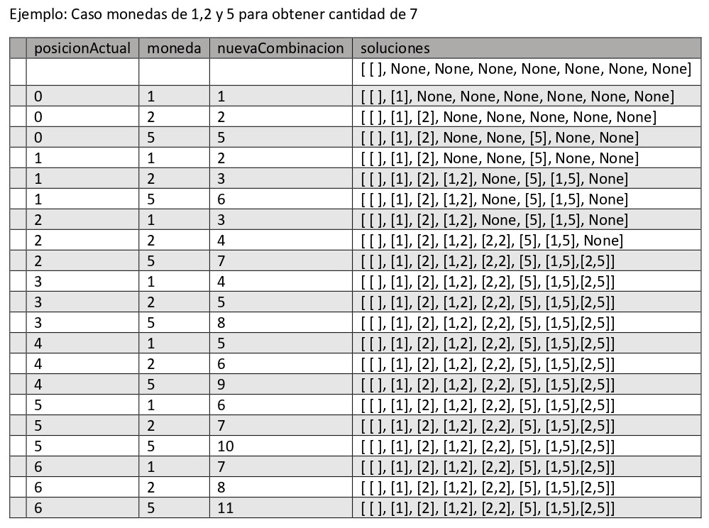

# Change-making-problem / Cambio de monedas

## Entendiendo el problema

Dada una cantidad de dinero y una lista de denominaciones de monedas, encontrar el número mínimo de monedas (de determinadas denominaciones) que sumen la cantidad de dinero exacta.

_Es un subcaso especial del problema de la mochila_

### Ejemplo 1:

Pagar la cantidad de 10 usando las siguientes monedas [2,3,5,6]
Tenemos 7 posibles combinaciones de cambios {2,2,2,2,2}, {2,2,3,3}, {2,2,6}, {2,3,5}, {5,5}

Donde la mejor combinación es {5,5} que usa la menor cantidad de monedas

## Consideraciones

- Este problema supone que todas las monedas están disponibles infinitamente.
- Dado el caso donde la cantidad de dinero es 0 el resultado sera una lista vacia [ ]
- Dado el caso donde no es posible pagar la cantidad con las monedas proporcionadas retornar nulo. Ejemplo cantidad=5 monedas[2,4]

## Solución 1

La primera solución contempla todas las posibles combinaciones, podemos implementarla dividiendo en pequeños subproblemas y aplicando recursividad.

Por cada moneda hacemos una resta de la cantidad de dinero menos el valor de la moneda de esta forma obtenemos un punto de inicio de cada combinación y dividimos el problema en subproblemas. Aqui podemos aplicar recursividad y continuar haciendo las restas mientras la cantidad a pagar disminuye y llega a 0, de esta forma obtenemos todas las posibles combinaciones. En esta parte necesitamos hacer una validación para detener la iteración cuando la cantidad llegue a igual o menor que 0 (Si llega a 0 sabemos que es una posible solución).

Ejemplo de divición de subproblemas para el caso, monedas: [1,2,3] y cantidad de 5

<!---

-->


Seguido de esto necesitamos encontrar la mejor solución que úse la menor cantidad de monedas, necesitamos hacer una comparacion para obtener la mejor solución de cada suproblema, guardarla y retornar la combinacion con menor cantidad de monedas por cada nivel (cada vez que disminuimos la cantidad a pagar).
_Por eso esta primera solución es una estrategia de análisis top-down (de arriba hacia abajo)_

```py
#monedas debe ser un arreglo de enteros, cantidad debe ser un entero no menor que 0
def makeChange(monedas, cantidad):
    if cantidad == 0: #Validación cuando lleguemos a la cantidad 0
        return []
    if cantidad < 0: #Validación para saber que llegamos a una cantidad negativa que no se puede pagar
        return None
    resultadoOptimo = None #declaramos e inicializamos el resultadoOptimo que retornaremos
    for moneda in monedas: #iteramos sobre cada moneda
        #llamamos a makeChange para obtener una posible solución
        #Restamos el valor actual de moneda para dividir en subproblemas
        combinacion = makeChange(monedas, cantidad - moneda) #Aqui podemos obtener [], None o una posible combinación
        if combinacion != None: #Validación para saber que es una posible combinacion
            candidata = combinacion + [moneda]
            #Comparamos si la solucion candidata es mejor que el resultadoOptimo actual lo remplazamos
            if (resultadoOptimo is None or len(candidata) < len(resultadoOptimo)):
                resultadoOptimo = candidata
    return resultadoOptimo
```

<!---

-->


Notemos que tenemos subproblemas que se repiten, dada la recursividad y el uso de todas las combinaciones posibles, esta solucion tiene una complejidad exponencial y poco rendimiento.

### Solución 1/versión 2:

Podemos guardar los resultados para reducir la complejidad a O(nv), n es la cantidad de monedas y v la cantidad de pasos, para esto podemos utilizar el módulo functools que nos proporciona un método llamado lru_cache que recibe una función de la cual vamos a poder guardar el resultado o lo que retorna, de esta forma si llamamos a una determinada función con los mismos argunmentos varias veces retornan el valor guardado en memoria sin ejecutar dicha función.

```py
from functools import lru_cache #import del módulo
def makeChange(monedas, cantidad): #Necesitamos una funcion como envolvente para manejar las monedas
    @lru_cache(maxsize=None, typed=False) #inicializamos la cache sin límite para la función helper
    def helper(cantidad): #Guardamos el resultado para cada cantidad
        if cantidad == 0:
            return []
        if cantidad < 0:
            return None
        resultadoOptimo = None
        for moneda in monedas:
            combinacion = helper(cantidad - moneda)
            if combinacion != None:
                candidata = combinacion + [moneda]
                if (resultadoOptimo is None or len(candidata) < len(resultadoOptimo)):
                    resultadoOptimo = candidata
        return resultadoOptimo
    return helper(cantidad)
```

<!---

-->


## Solucion 2, bottom-up O(nv)

La segunda solución contempla la estrategia de análisis bottom-up, guiandonos de la primera solución empezaremos con la cantidad de 0 agregando las posibles combinaciones de monedas hasta llegar a la cantidad final.

```py
def makeChange2(monedas, cantidad):
    # Se crea una lista del tamaño de la cantidad + 1 con elementos con valor inicial nulo
    # Si la cantidad es 5 nos da--> [None, None, None, None, None, None] lista con 6 elementos nulos
    soluciones = [None] * (cantidad + 1)
    # Si la cantidad es 5 nos da--> [[], None, None, None, None, None]
    soluciones[0] = []
    # Empezando de la posición 0 encontraremos combinaciones para otras cantidades agregando los valores de las monedas
    for posicionActual in range(cantidad):
        # Si no tenemos una combinación para la posición actual no podemos sacar mas combinaciones a partir de esa
        if soluciones[posicionActual] != None:
            for moneda in monedas:
                # Cantidad de la nueva Combinacion a evaluar
                nuevaCombinacion = posicionActual + moneda
                if nuevaCombinacion <= cantidad:  # con esta condicion verificamos que la combinacion no de una suma por encima de la cantidad
                    # Si no existe una combinacion en la lista de soluciones para la cantidad de nueva combinación, se agrega o
                    # si la nuevaCombinacion es mejor que la actual se remplaza
                    if (soluciones[nuevaCombinacion] == None or
                        len(soluciones[nuevaCombinacion]) >
                            len(soluciones[posicionActual]) + 1):
                        soluciones[nuevaCombinacion] = soluciones[posicionActual] + [moneda]
    return soluciones[cantidad]
```



Esta solución es mejor que la primera porque es iterativa y evita las llamadas recursivas, pero es poco eficiente para casos donde la cantidad sea grande, porque la cantidad a evaluar va en uno en uno, por ejemplo:
para pagar la cantidad de 500 teniendo monedas de 100, 200 y 300 va de 1 hasta 500, ademas se contemplan cantidades que no se pueden pagar como 103.

### Tiempos de ejecución y complejidad:

**Solución 1** O(n)

##

> Cada solución es manejada como un módulo, el archivo main.py junta y llama cada solución y calcula su tiempo de ejecución, por defecto maneja el caso de monedas=[1,2,3,4,5,6,7,8,9] y cantidad=20 la cual se puede cambiar en main.py

```sh
    //with python 3
    python main.py
```
